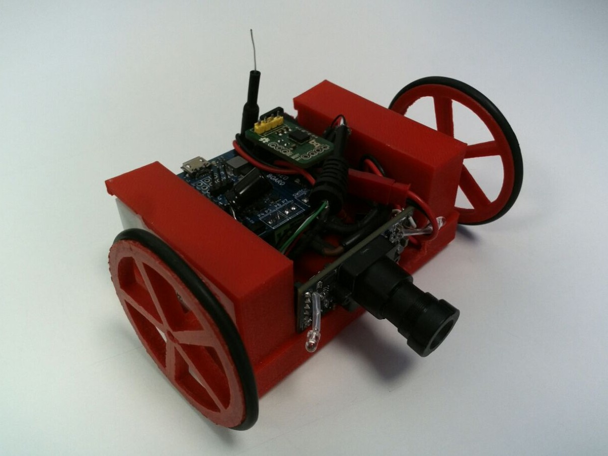

# Rover

A wheeled camera robot with a [NanoPi Neo Air](http://nanopi.io/nanopi-neo-air.html) SBC, its  [NeoBoard](https://github.com/alvaroferran/NeoBoard) motor + battery shield, the [BNO055](https://github.com/alvaroferran/BNO055/tree/master/Library/Python) 9DOF IMU and a webcam.

